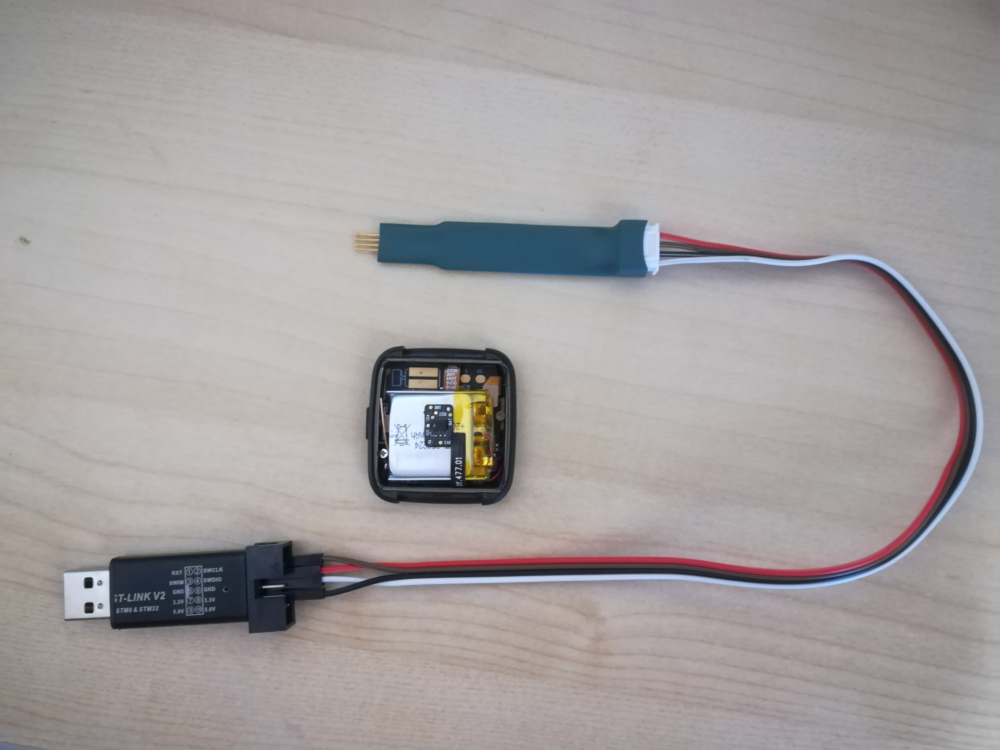
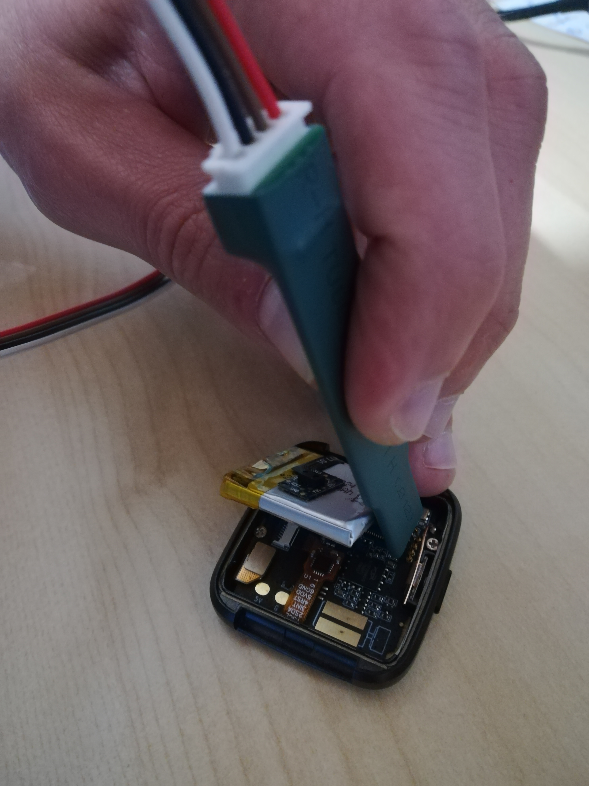

# OpenOCD and STLink
OpenOCD (**Open O**n **C**hip **D**ebugger) is an open source tool that interfaces with many SWD/JTAG debugger to provide debugging and *in-system* programming for embedded target devices.

It supports the **NRF52** (the CPU of the PineTime) and the **STLinkV2**, a cheap SWD debugger.

It works on X86 computers, as well as ARM/ARM64 computers and SBC (like the RaspberryPi and Pine64 Pinebook Pro) !

## Installation
We will build OpenOCD from sources, as packages from Linux distributions are most of the time outdated and do not support the NRF52 correctly. 

 - Fetch the sources from GIT, and build and install it:

```
git clone https://^Ct.code.sf.net/p/openocd/code openocd-code

cd openocd-code

./bootstrap
./configure --enable-stlink
make -j 4
sudo make install
```

 - Configure UDEV to allow OpenOCD to open the interface to your STLinkV2:
```
sudo cp contrib/60-openocd.rules /etc/udev/rules.d/
sudo udevadm control --reload-rules
```

 - You can now plug your STLinkV2 in a USB port and run OpenOCD to see if it's working correctly:

```
$ openocd -f interface/stlink.cfg -f target/nrf52.cfg
Open On-Chip Debugger 0.10.0+dev-01411-g051e80812-dirty (2020-09-28-20:16)
Licensed under GNU GPL v2
For bug reports, read
        http://openocd.org/doc/doxygen/bugs.html
Info : auto-selecting first available session transport "hla_swd". To override use 'transport select <transport>'.
Info : The selected transport took over low-level target control. The results might differ compared to plain JTAG/SWD

nRF52 device has a CTRL-AP dedicated to recover the device from AP lock.
A high level adapter (like a ST-Link) you are currently using cannot access
the CTRL-AP so 'nrf52_recover' command will not work.
Do not enable UICR APPROTECT.

Info : Listening on port 6666 for tcl connections
Info : Listening on port 4444 for telnet connections
Info : clock speed 1000 kHz
Info : STLINK V2J34S7 (API v2) VID:PID 0483:3748
Info : Target voltage: 3.294340
Error: init mode failed (unable to connect to the target)
```
Ok, OpenOCD is running and it detects my STLinkV2. The last error shows that I've not connected the STLinkV2 to the PineTime.

## Configuration files
OpenOCD is configured using configuration files.
First, we need a common configuration file for the project : **openocd-stlink.ocd**:
```
source [find interface/stlink.cfg]

gdb_flash_program enable
gdb_breakpoint_override hard

source [find target/nrf52.cfg]
```
This file specifies to OpenOCD which debugger and target it will be connected to..

Then, we use various *user files* to use OpenOCD to flash InfiniTime binary files.

This files flashes the bootloader and the application firmware : **flash_bootloader_app.ocd**:
```
init

program <build directory>/bootloader.bin verify 0x00000000
program <build directory>/image-0.8.2.bin verify 0x00008000

reset
```

And this one flashes the graphics flasher (it writes the bootloader graphics into the SPI NOR flash memory) : **flash_graphics.ocd**:
```
init

program <build directory>/pinetime-graphics-0.8.2.bin verify 0x00000000

reset
```

## Examples
### Flash bootloader and application
```
openocd -f ./openocd-stlink.cfg -f ./flash_bootloader_app.ocd
```

### Flash graphics flasher
```
openocd -f ./openocd-stlink.cfg -f ./flash_graphics.ocd
```

## Connect the STLinkV2 to the PineTime
Here is an example using the pogo pins:



You can find more information about the SWD wiring [on the wiki](https://wiki.pine64.org/index.php?title=PineTime_devkit_wiring).